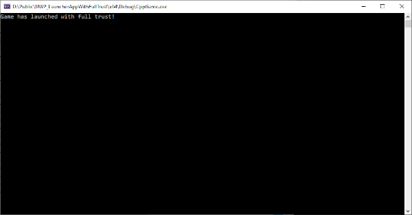

# UWP_LauncherAppWithFullTrust

## Repository Description

```
UWP project with a launcher that launches an app with full trust
```

## Overview

MS Store builds are sandboxed with security preventing code from executing outside of the original process.

In some cases, you need execution to work outside of the main process to access a service or to control RGB hardware.

Launching an application with fulltrust allows this scenario. A full trust application will be able to access the Win32 APIs necessary to control RGB hardware.

This project is setup with a Windows Application Packaging Project that references two UWP projects. The UWP launcher project launches a UWP game project with full trust.

## Observations

* `@TODO:` The UWP sample application doesn't seem to be able to launch the UwpGame.exe with full trust.

```
Windows.ApplicationModel.FullTrustProcessLauncher.LaunchFullTrustProcessForAppAsync("UwpGame", "UwpGame");
```

* The C++ console application CppGame.exe launches successfully with full trust.

```
Windows.ApplicationModel.FullTrustProcessLauncher.LaunchFullTrustProcessForAppAsync("CppGame", "CppGame");
```

## Screenshots

**The UWP launcher app**


**The UWP game app**


**The C++ game app**


